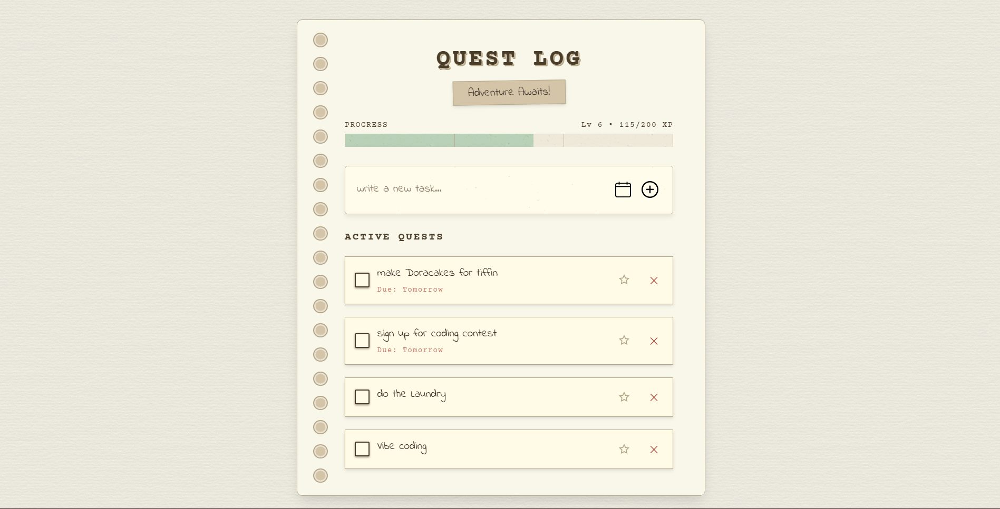
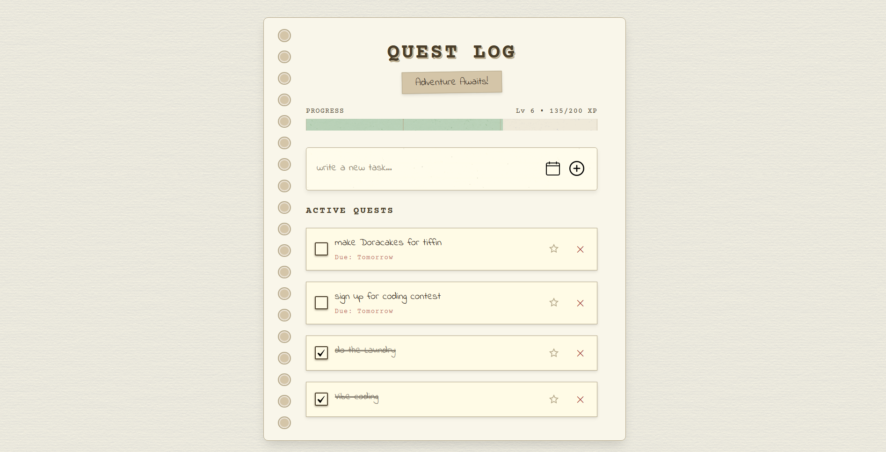
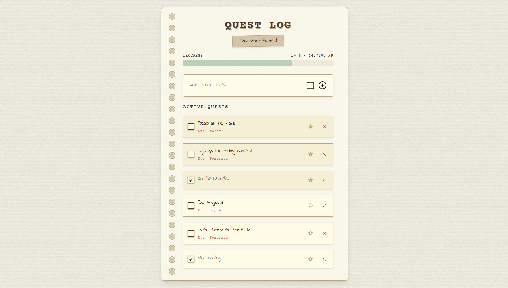

# Quest Log 🗒️✨

A retro notebook–styled, gamified task tracker. Add quests, earn XP, level up, and watch your productivity grow—100% vanilla HTML + CSS + JavaScript (no build step, no frameworks).

## 🔥 Preview

| Desktop                                   | Completed                                 | Edit / Favorite                           |
| ----------------------------------------- | ----------------------------------------- | ----------------------------------------- |
|  |  |  |

> Add screenshots to a `screenshots/` folder (or swap URLs) so these render.

Live Demo (optional): `https://Quest-Log.ankankun.me/`

---

## 🎯 Concept

Turn a plain to‑do list into a tiny RPG ritual:

- Tasks become **quests**.
- Completing them grants **XP** & levels.
- Favorites (⭐) auto-float to the top.
- Notebook aesthetic + micro-interactions keep it tactile.

---

## ✨ Features

- Add quests with optional due date (labels: Today / Tomorrow / Overdue).
- Inline edit (double‑click quest text).
- Mark complete for XP + floating star + celebratory flash.
- XP & Level system with scaling requirements.
- Favorites sort above others automatically.
- Dynamic spiral binding holes based on height.
- Local persistence via `localStorage` (tasks, XP, level).
- Accessible focus states + keyboard usage.
- Pure CSS design tokens for fast theming.

---

## 🧪 XP & Level Mechanics

| Action                      | XP  |
| --------------------------- | --- |
| Add quest                   | +5  |
| Complete quest (first time) | +10 |

Level requirement: `100 + (level - 1) * 20`.
Excess XP rolls into the next level. A banner appears on level-up.

---

## 🗂️ Structure

```
Quest-Log/
  index.html        # Markup
  style.css         # Styles, tokens, animations
  script.js         # Logic: state, XP, rendering
  assets/           # add.png, calendar.png, check.png
  design-tokens.json
  style-guide.md
  component-breakdown.md
  README.md
  screenshots/      # (add your images)
```

---

## 🏛️ Architecture

| Part              | Role                                                                     |
| ----------------- | ------------------------------------------------------------------------ |
| Global state vars | `tasks`, `xp`, `level`                                                   |
| Persistence       | `localStorage` (keys: `questLog_tasks`, `questLog_xp`, `questLog_level`) |
| Rendering         | Full list rebuild via template cloning (simple & predictable)            |
| Sorting           | favorites → incomplete → complete → newest                               |
| Gamification      | `xpForLevel()`, `addXP()`, rollover logic                                |
| Dynamic UI        | inline editing, star toggle, animated completion                         |

---

## 📄 Key Functions (script.js)

- `render()` – Rebuilds quest list (keeps code understandable).
- `addXP(amount)` – Adds XP and handles level overflow.
- `xpForLevel(level)` – Progressive difficulty.
- `updateBindingHoles()` – Generates spiral holes based on container height.
- `formatDue(dateStr)` – Human-friendly due labels.

---

## ♿ Accessibility

- Descriptive `aria-label`s for controls.
- `:focus-visible` usage for keyboard-only outlines.
- Buttons instead of divs for interactive elements.

---

## 🎨 Theming

All major colors & fonts live at the top of `style.css` under `:root`. Example:

```css
:root {
  --paper-bg: #f8f5e6;
  --ink-primary: #4a3e2a;
  --progress-bar: #a4c3a2;
  --reward-star: #d4b556;
}
```

Swap fonts or tweak palette instantly. Try a dark mode variant by scoping overrides under a `.dark` class.

---

## 🚀 Getting Started

```bash
git clone https://github.com/Ankankun/Quest-Log.git
cd Quest-Log
```

Open `index.html` directly, or run a lightweight server:

```bash
# Python 3
python -m http.server 5173
# then visit http://localhost:5173
```

No build step. Just code.

---

## 💾 Persistence Details

| Data  | Key              | Format            |
| ----- | ---------------- | ----------------- |
| Tasks | `questLog_tasks` | JSON string array |
| XP    | `questLog_xp`    | Integer           |
| Level | `questLog_level` | Integer           |

Isolation: browser + device + profile. Incognito/private windows reset on close.

### Manual Export / Import

```js
// Export
copy(JSON.stringify({
  tasks: localStorage.getItem('questLog_tasks'),
  xp: localStorage.getItem('questLog_xp'),
  level: localStorage.getItem('questLog_level')
}));

// Import
const data = /* paste object */;
localStorage.setItem('questLog_tasks', data.tasks);
localStorage.setItem('questLog_xp', data.xp);
localStorage.setItem('questLog_level', data.level);
location.reload();
```

---

## 📈 Possible Enhancements

- Daily streaks & achievements
- Tag / category filters
- Export / import UI
- Search & batch actions
- Dark / sepia themes
- Cloud sync (Supabase / Firebase)
- Keyboard shortcuts (e.g., `N` for new quest)

---

## 🧪 Learning Exercises

| Goal               | Start In                       |
| ------------------ | ------------------------------ |
| Change level curve | `xpForLevel()`                 |
| Add bulk complete  | New toolbar + iterate tasks    |
| Add search         | Filter inside `render()`       |
| Swap tick graphic  | `.checkbox.checked` background |
| Add animations     | Extend CSS keyframes           |

---

## ⚙️ Performance Notes

- Re-render is O(n); fine for typical personal use (< 1–2k tasks).
- No virtual DOM; clarity > micro-optimization.
- Minimal layout thrash (single rebuild per action).

---

## 🛡️ License

MIT License © 2025 YOUR NAME (change as you wish).

---

## 🤝 Acknowledgements

- Fonts: Google Fonts (Courier Prime, Indie Flower)
- Textures: transparenttextures.com
- Inspiration: stationery + light gamification.

---

## 💬 FAQ

| Q                                | A                                             |
| -------------------------------- | --------------------------------------------- |
| Why no frameworks?               | Showcases grasp of raw DOM + state.           |
| Can data sync across devices?    | Not yet—needs backend or manual export.       |
| How do I theme it?               | Edit CSS variables in `:root`.                |
| Where do spiral holes come from? | JS generates `span` elements based on height. |

---

## 🔗 Use in Portfolio / LinkedIn

Narrative hook ideas:

- "Built a gamified task app with zero frameworks to highlight core web fundamentals."
- "Implemented scalable level system + dynamic visual affordances (spiral binding)."
- "Focused on reverse-engineer‑able code for teaching/interview contexts."

---

Happy questing! Feel free to fork and extend.
